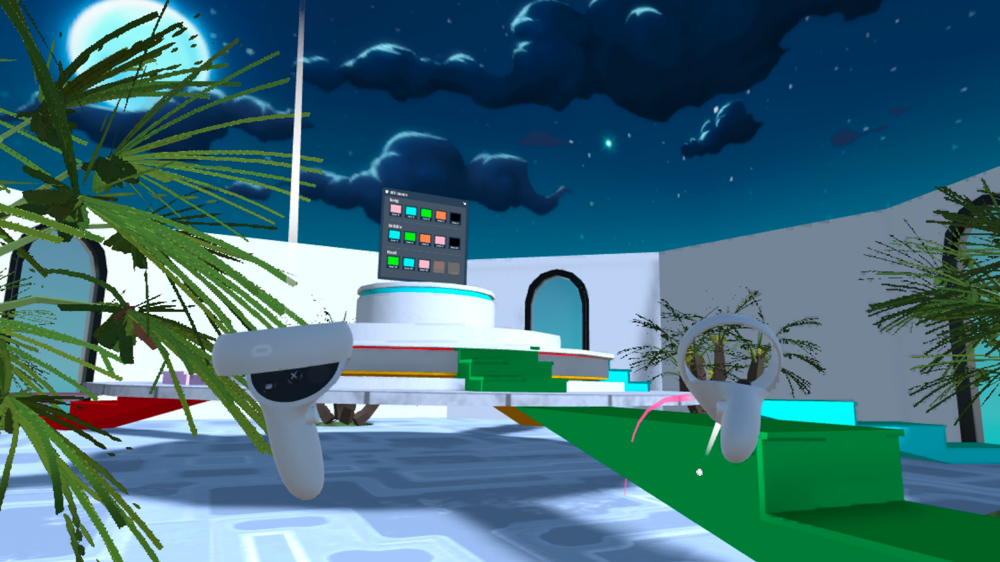
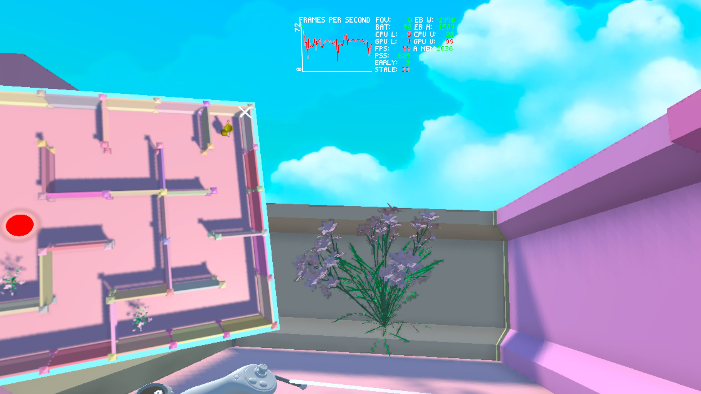

# Maze Escape VR

Maze Escape VR is a virtual reality game where the player must find the exit of a maze in an immersive 3D environment. Designed for VR platforms, the experience challenges players' navigation and spatial reasoning as they explore and try to escape the labyrinth.

---

## Preview
<p align="center" width="100%">
     
    <figcaption>The Menu scene</figcaption>
</p>

---

<p align="center" width="100%">
     
    <figcaption>The Game scene</figcaption>
</p>

---

## Features

- Fully immersive VR maze exploration
- Intuitive controls for seamless movement
- Designed for Oculus and compatible VR headsets
- Engaging environment that enhances the feeling of being lost in a maze

---

## Getting Started

**Prerequisites**

- VR headset
- Compatible VR-ready PC
- Unity 6 installed
- Tested with Meta Quest 2 device

**Installation**

1. Clone the repository:

```bash
git clone https://github.com/cvetelinast/maze-escape-vr.git
```

2. Open the project in Unity 6.
3. Build and run the project on your VR headset.

---

## Gameplay

- From the menu scene, select an unlocked level to play. You can use your VR controllers to navigate through the maze. Teleportation is the recommended navigation method, but a walkthrough also works.
- Explore corridors, collect items, and find the exit.
- Enjoy the immersive experience as you try to escape the virtual maze.

---
